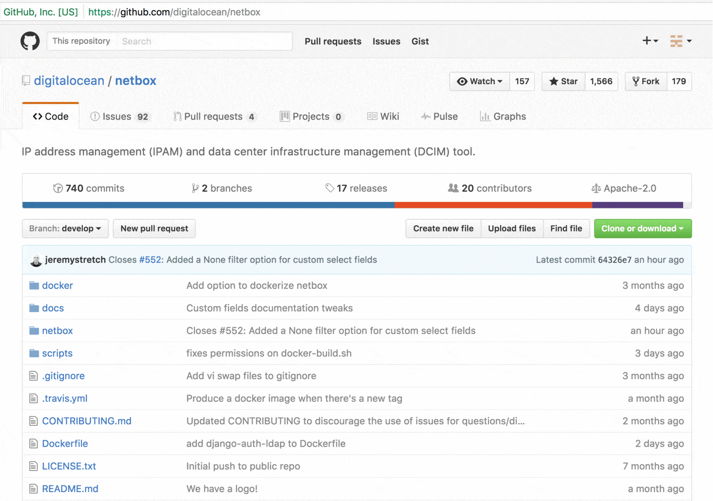
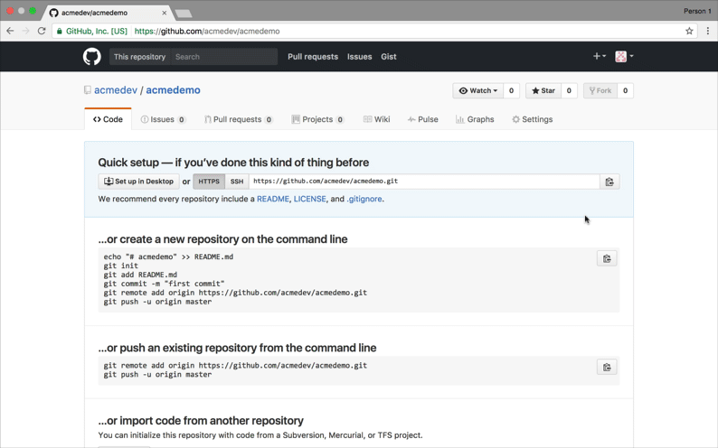

# Auto Deployed Resume
Many devs have their resume's latex file on github as a git repo.  
This repository shows how to have it automatically compiled by TravisCI and hosted by Github pages.

# Setup

1. [Fork this repo](#fork-this-repository-to-your-profile)
1. [Setup github pages](#setup-github-pages)
1. [Setup Travis CI](#setup-travis-ci)
1. [Minor Adjustments](#minor-adjustments)

## Fork this repository to your profile
Firstly, fork this project to your github profile using the fork button above

## Setup Github pages
Go to settings of your new forked repo

In the "Github Pages" section, enable github pages by choosing "gh-pages" branch as "Source".  
Now anything present in the gh-pages branch of your repo will be available at `http://github_username.github.io/resume`  

## Setup Travis CI
We will use [TravisCI](https://travis-ci.org) to build the latex file and commit the build pdf to gh-pages branch.  

Lets generate a github access token for TravisCI to be able to push commits to your repository:

Do give it `repo` permission. You can name it whatever you like.

Notice that the [`deploy.sh`](https://github.com/ShikherVerma/resume/blob/master/deploy.sh#L33) script uses an environment variable `$GH_TOKEN` as password!  
We will add the github access token we generated in the last step as an environment variable named `$GH_TOKEN`.
There are two ways to do this.

#### Method 1 : Add encrypted variable in .travis.yml
This method is older, [more transparent](https://docs.travis-ci.com/user/encryption-keys).  

1. Delete the `env.matrix` block from `.travis.yml`
1. Install `travis` gem by `gem install travis`
1. Change directory to your repository directory
1. Run `travis encrypt GH_TOKEN='your_access_token_here' --add env.matrix`. Replace `your_access_token_here` with actual access token.

You might have to log in to the travis gem first. The above steps should have changed the encrypted environment
variable line in `.travis.yml`. If that did not work, visit [this](https://docs.travis-ci.com/user/environment-variables/#Defining-encrypted-variables-in-.travis.yml) for more details.

#### Method 2 : Add variables in Travis Repository Settings
This method is easier and faster but its not clear how TravisCI manages the security of these.

1. Navigate to the repository in question by visiting `https://travis-ci.org/github_username/repo_name`
1. Choose "Settings" from the cog menu and click on "Add new variable" in the "Environment variables" section.
1. Add name=GH_TOKEN and value=your_access_token_here . Replace `your_access_token_here` with actual access token.
1. Delete the `env.matrix` block from `.travis.yml` 

Thats it! If you get stuck on some step see more details [here](https://docs.travis-ci.com/user/environment-variables/#Defining-Variables-in-Repository-Settings).

## Minor adjustments
There are 3 more files to configure.

1. Change values of unencrypted environment variables in [`deploy.sh`](https://github.com/ShikherVerma/resume/blob/master/deploy.sh#L6) in master branch:
	* `GH_USER` for github username
	* `GH_EMAIL` for commit email
	* `GH_REPO` for the repo name (in case you rename your fork)
2. `gh-pages` branch contains an [`index.html`](https://github.com/ShikherVerma/resume/blob/gh-pages/index.html#L9) which redirects the user to the compiled resume. Change the redirect url to `http://github_username.github.io/repo_name/pdf_name.pdf`. By default `repo_name` and `pdf_name` would be resume.
3. `gh-pages` branch also contains a [`CNAME`](https://github.com/ShikherVerma/resume/blob/gh-pages/CNAME) file. Which is used to redirect shikherverma.github.io/resume to resume.shikherverma.com . Delete this file. Or if you have a domain name you can also [configure subdomain for project](https://help.github.com/articles/setting-up-a-custom-subdomain/) like me.

## Questions, Bugs and Issues
Have a question about this project?  
Or want to report a bug or an issue with this setup?  
Open a new issue [here](https://github.com/ShikherVerma/resume/issues) on GitHub!
